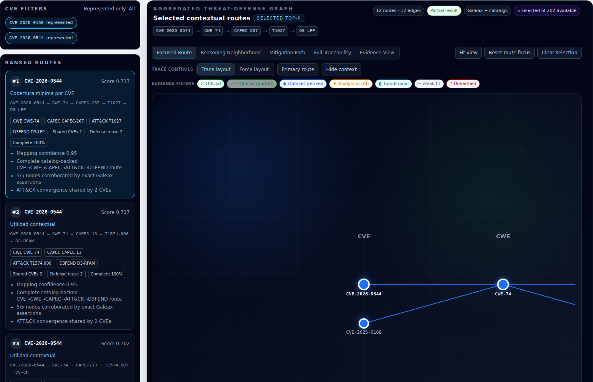
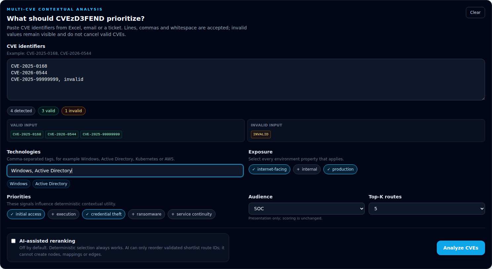
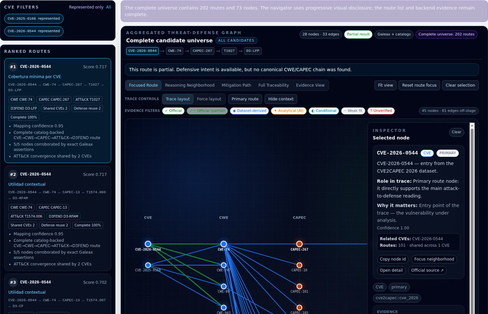
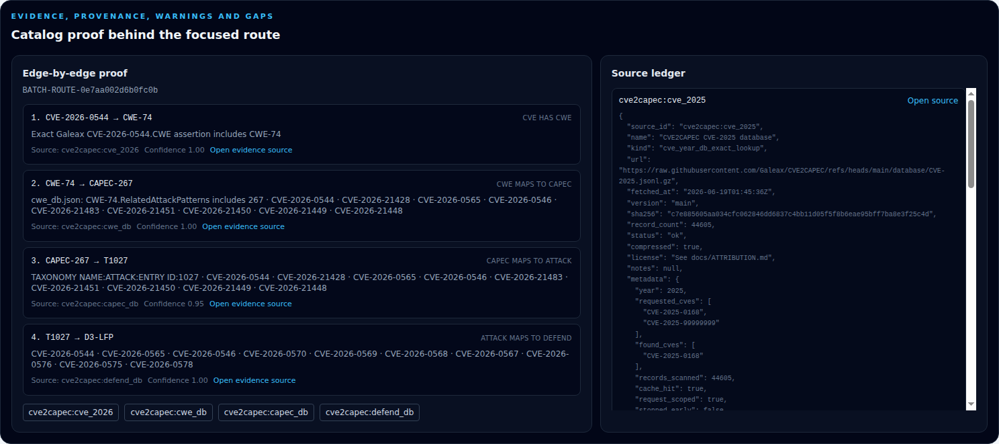
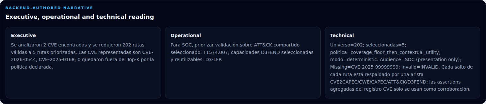
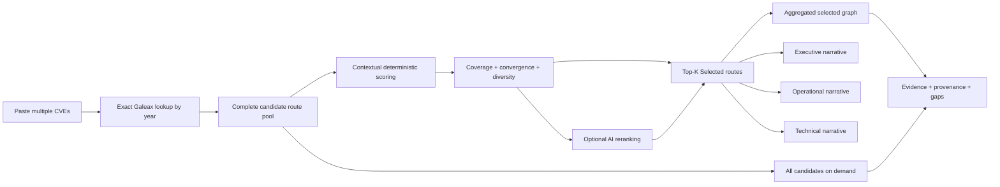
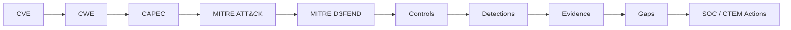
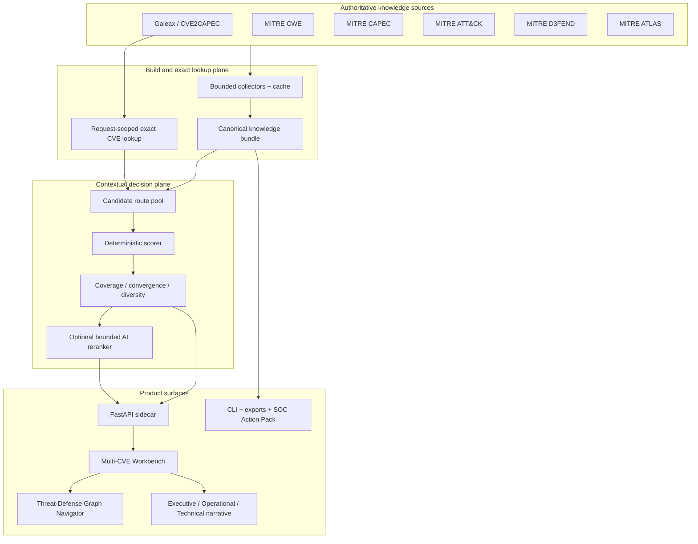

<div align="center">

# CVEzD3FEND

### From CVE lists to prioritized defensive action.

**Paste multiple CVEs. Add operational context. Receive the defensive routes that matter most — ranked, explained, navigable, and backed by Galeax evidence.**

[](https://github.com/vPabloA/CVEZD3FEND)
[](pyproject.toml)
[](web/)
[](web/)
[](src/CVEzD3FEND/api/)
[](docs/ATTRIBUTION.md)

<br />



</div>

---

## The operational question

Security teams rarely need another list of vulnerabilities. They need to know:

> **Given these CVEs, this environment, and these operational priorities — which offensive and defensive routes deserve attention first, what do they have in common, and what evidence supports the decision?**

CVEzD3FEND answers that question by turning the complete Galeax/CVE2CAPEC relationship universe into a contextual decision surface:

```text
Multiple CVEs
    → exact Galeax lookup
    → catalog-backed candidate routes
    → contextual deterministic scoring
    → optional AI-assisted reranking
    → Top-K defensive routes
    → aggregated graph
    → evidence, provenance and actionable narrative
```

> **Galeax shows everything related. CVEzD3FEND shows what matters most, explains why, and preserves access to the complete evidence.**

---

## What the analyst gets

| Product capability | Operational value |
|---|---|
| **Multi-CVE contextual analysis** | Analyze a vulnerability portfolio instead of handling isolated CVEs one at a time. |
| **Deterministic Top-K selection** | Prioritize several defensible routes with explicit scores, reasons, coverage policy, diversity and convergence. |
| **Selected by default** | Start with a reduced, decision-ready graph instead of a graph dump. |
| **All candidates on demand** | Inspect the complete Galeax-derived universe without losing provenance or evidence. |
| **ATT&CK convergence** | Identify techniques shared by multiple CVEs and concentrate validation effort. |
| **Reusable D3FEND capabilities** | Find defensive measures with benefit across several selected routes. |
| **Grounded narrative** | Receive executive, operational and technical explanations authored from selected routes and valid evidence. |
| **Bounded AI assistance** | AI may rerank validated route IDs; it cannot invent nodes, mappings or edges. |
| **Truth-preserving visualization** | Visual caps reduce surrounding context, never the semantic truth of the focused route. |
| **Partial-state honesty** | Missing CVEs, invalid inputs, gaps, unavailable sources and deterministic fallback remain visible. |

---

## Why CVEzD3FEND is different

| Common security output | What it usually gives you | What CVEzD3FEND adds |
|---|---|---|
| Vulnerability feed | CVE severity and enrichment | Cross-CVE offensive and defensive route analysis |
| Mapping database | Every known relationship | Contextual selection of the routes that matter now |
| Graph explorer | A large navigable graph | **Selected** for decisions and **All** for complete evidence |
| LLM assistant | Fluent recommendations | Catalog-constrained reranking with deterministic fallback |
| Executive report | A summarized conclusion | Grounded narrative linked to route evidence and provenance |
| Control recommendation | Isolated mitigations | D3FEND reuse across multiple CVEs and ATT&CK convergences |

The product does **not** replace Galeax, ATT&CK, CAPEC, CWE or D3FEND. It consumes them as authoritative knowledge inputs and adds context, ranking, explainability and product experience.

---

## Product experience

### 1. Paste a vulnerability set and add context

The workbench accepts CVEs separated by lines, commas or spreadsheet whitespace. It normalizes and deduplicates input, reports invalid and missing identifiers, and continues with the valid subset.



Context includes:

- Technologies such as Windows, Active Directory, Linux, Kubernetes or AWS.
- Exposure such as internet-facing, internal or production.
- Priorities such as initial access, credential theft, ransomware or service continuity.
- Audience such as SOC, Threat Hunting, Detection Engineering, CTEM or Executive.
- Top-K route selection: 5, 10 or 20.
- Optional AI-assisted reranking, disabled by default.

### 2. Start with Selected

The first response intentionally returns only the decision-ready projection:

- Ranked routes.
- `selected_graph`.
- Selected ATT&CK convergence.
- Selected D3FEND reuse.
- Selection reasons and basis.
- Executive, operational and technical narrative.
- Evidence, provenance, warnings and gaps.

No complete candidate universe is loaded automatically.

### 3. Expand to All candidates when evidence exploration is required

<table>
<tr>
<td width="50%" valign="top">
<strong>Selected</strong><br />
Top-K routes prioritized for the declared context. Fast, focused and decision-ready.
</td>
<td width="50%" valign="top">
<strong>All candidates</strong><br />
The complete candidate graph, loaded explicitly and cached for the active request.
</td>
</tr>
<tr>
<td></td>
<td></td>
</tr>
</table>

The browser consumes `selected_graph` and `candidate_graph` exactly as delivered. It performs visual projection and canonical-ID deduplication only. It never creates mappings or synthesizes graph relationships.

### 4. Inspect the evidence behind every decision

<table>
<tr>
<td width="50%"></td>
<td width="50%"></td>
</tr>
<tr>
<td valign="top"><strong>Evidence and provenance</strong><br />Inspect catalog references, edge evidence, gaps, confidence and source metadata for the focused route.</td>
<td valign="top"><strong>Three levels of narrative</strong><br />Translate the same selected evidence for executives, SOC operators and technical reviewers.</td>
</tr>
</table>

---

## Product flow



### Canonical semantic chain



---

## Selection engine

CVEzD3FEND builds the complete eligible route pool **before** applying Top-K. It does not select the first route and does not trim the graph before user context is known.

Deterministic scoring can consider:

- Mapping confidence.
- Route completeness.
- Technology match.
- Exposure match.
- Operational-priority match.
- ATT&CK convergence across CVEs.
- Defensive reuse across selected routes.
- Redundancy and unresolved-gap penalties.

Every selected route exposes:

```text
selection_rank
selection_basis
score
selection_reasons
CVE / CWE / CAPEC / ATT&CK / D3FEND IDs
shared_cve_count
defensive_reuse_count
completeness
gaps
evidence
provenance
```

Selection bases remain explicit:

| Selection basis | Meaning |
|---|---|
| `coverage_floor` | Preserves minimum representation for an eligible CVE when Top-K allows it. |
| `contextual_utility` | Adds route value through context, convergence, diversity or defensive reuse. |
| `top_k_constraint` | Applies the declared deterministic policy when K is lower than eligible CVE count. |
| `ai_rerank` | Reorders only validated shortlist route IDs. |

---

## Trust model

The design rule is simple:

> **The catalogs demonstrate the edges. The selection engine decides which valid routes deserve attention.**

CVEzD3FEND preserves five trust boundaries:

1. **Galeax remains upstream** — CVEzD3FEND does not rebuild or silently replace the source mapping universe.
2. **The candidate graph remains complete** — Selected is a projection, never evidence deletion.
3. **React never creates semantic relationships** — visualization cannot assert an edge the backend did not deliver.
4. **AI is bounded** — unknown route IDs are rejected and deterministic fallback preserves availability.
5. **Fallback is not human review** — AI unavailability preserves deterministic selection; review is reserved for real gaps or unresolved relationships.

When the complete universe exceeds the visual cap, the focused route remains intact. Progressive disclosure can hide surrounding context, but it cannot truncate or reinterpret the route being inspected.

---

## Architecture



The static bundle is the canonical graph. The FastAPI sidecar adds request-scoped exact Galeax lookup and batch contextual analysis without mutating that bundle.

---

## Quick start

### Requirements

| Requirement | Version / notes |
|---|---|
| Python | 3.10 or newer |
| Node.js | 20 or newer recommended |
| npm | Installed with Node.js |
| Git | Required to clone the repository |
| GNU Make | Build and validation shortcuts |
| Internet access | Required during the initial source build |

### Install and build

```bash
git clone https://github.com/vPabloA/CVEZD3FEND.git
cd CVEZD3FEND

make install
make build
make validate
make test
make web-build
```

### Run the product

**Terminal 1 — API**

```bash
.venv/bin/CVEzD3FEND api
```

**Terminal 2 — UI**

```bash
make serve
```

Open:

```text
http://127.0.0.1:8787/#/analyze
```

API health and documentation:

```text
http://127.0.0.1:8000/api/health
http://127.0.0.1:8000/docs
```

### Development UI

Keep the API running, then:

```bash
cd web
npm run dev
```

Open `http://127.0.0.1:5173/#/analyze`.

<details>
<summary><strong>Existing clone, daily startup and clean rebuild</strong></summary>

### Update an existing clone

```bash
cd CVEZD3FEND
git status --short
git switch main
git pull --ff-only
```

Protect uncommitted work first when necessary:

```bash
git stash push -u -m "wip before updating CVEzD3FEND"
```

### Daily startup

Terminal 1:

```bash
.venv/bin/CVEzD3FEND api
```

Terminal 2:

```bash
make serve
```

### Clean rebuild

```bash
make clean
make install
make build
make validate
make test
make web-build
```

</details>

---

## Try the real multi-CVE flow

Paste into the workbench:

```text
CVE-2025-0168
CVE-2026-0544
CVE-2025-99999999
invalid
```

Use:

```text
Technologies: Windows, Active Directory
Exposure: internet-facing, production
Priorities: initial access, credential theft
Audience: SOC
Top-K: 5
AI-assisted reranking: Off
```

The result should:

- Continue with valid CVEs while declaring missing and invalid inputs.
- Produce several ranked routes rather than one route.
- Load Selected first.
- Load All candidates only after explicit user action.
- Preserve ranking, evidence, provenance and gaps.
- Separate deterministic fallback from real human-review conditions.
- Keep the focused route complete even when surrounding context is visually reduced.

Exact counts may change when upstream data changes. Product contracts and trust invariants must not.

---

## Batch API

```bash
curl -sS http://127.0.0.1:8000/api/reason/batch \
  -H 'Content-Type: application/json' \
  -d '{
    "cve_ids": [
      "CVE-2025-0168",
      "CVE-2026-0544",
      "CVE-2025-99999999",
      "invalid"
    ],
    "context": {
      "technologies": ["Windows", "Active Directory"],
      "exposure": ["internet-facing", "production"],
      "priorities": ["initial access", "credential theft"],
      "audience": "SOC"
    },
    "top_k": 5,
    "include_all_candidates": false,
    "use_ai": false
  }' | jq
```

Set `include_all_candidates` to `true` only for the on-demand All view. An omitted `candidate_graph` means **not requested**, not **no candidates exist**.

---

## Runtime surfaces

| Surface | Command | Purpose |
|---|---|---|
| Multi-CVE Workbench | `make serve` | Selected/All analysis, graph navigation, ranking and narrative |
| FastAPI sidecar | `.venv/bin/CVEzD3FEND api` | Batch and single-CVE reasoning endpoints |
| CLI search | `.venv/bin/CVEzD3FEND search T1059` | Search canonical nodes and aliases |
| Route view | `.venv/bin/CVEzD3FEND route CVE-2026-0544` | Render the top deterministic route |
| SOC Action Pack | `.venv/bin/CVEzD3FEND export soc-action-pack CVE-2026-0544 --format md` | Generate defensive actions, evidence and gaps |
| MCP server | `.venv/bin/CVEzD3FEND mcp` | Optional local automation interface |

Full operational reference: [`docs/OPERATIONS.md`](docs/OPERATIONS.md).

---

## Validation

```bash
python3 -m compileall src tests
.venv/bin/pytest -q

cd web
npm run lint
npm run test
npm run build
cd ..

git diff --check
```

The product release was validated across backend tests, frontend tests, production build, trust-boundary checks, a real multi-CVE demonstration and API smoke validation.

---

## Failure and degraded states are product states

CVEzD3FEND does not hide uncertainty behind a green dashboard. The workbench explicitly handles:

- Invalid CVE input.
- CVEs not found in the requested Galeax year source.
- Partial success.
- Zero graphable routes.
- Upstream source unavailability.
- Candidate limits and dense graph universes.
- AI disabled, rejected or unavailable.
- Deterministic fallback.
- All-candidates request failure without destroying Selected.
- Structural gaps and genuine review-required relationships.

---

## Repository layout

```text
src/CVEzD3FEND/
  api/                 FastAPI sidecar
  reasoning/           exact lookup, candidate pool, scoring, selection, narrative
  graph/               canonical graph builder, catalogs and indexes
  routing/             CVE-anchored and framework routes
  validation/          structural validation and quality reports
  coverage/            gaps and CTEM action model
  actions/             SOC Action Pack generation
  intelligence/        governed AI providers and candidate state machine
  export/              Markdown, Mermaid, JSON and CSV outputs
  cli.py               Typer command-line interface

web/
  src/                 React + TypeScript workbench
  docs/screenshots/    real product evidence

contracts/             formal trust and interoperability contracts
docs/                  architecture, operations, governance and data sources
data/                  generated raw, cache, dist and review artifacts
```

---

## AI governance

AI is optional and disabled by default. The multi-CVE workbench is fully operational with deterministic selection.

When enabled, AI may:

- Rerank existing deterministic-shortlist route IDs.
- Summarize selection reasons.
- Expand template-backed narrative without changing graph truth.
- Propose candidate mappings for a separate governed review queue.

AI may not:

- Create canonical CVE, CWE, CAPEC, ATT&CK or D3FEND nodes.
- Create or modify canonical edges.
- Override provenance or structural validation.
- Turn an unknown ID into a valid relationship.
- Block analysis when the provider is unavailable.

The validator wins. Deterministic fallback preserves the product.

See [`docs/AI_GOVERNANCE.md`](docs/AI_GOVERNANCE.md) and [`contracts/AI_ASSISTANCE_CONTRACT.md`](contracts/AI_ASSISTANCE_CONTRACT.md).

---

## Documentation

- [Product vision](docs/PRODUCT_VISION.md)
- [Operations](docs/OPERATIONS.md)
- [Data sources](docs/DATA_SOURCES.md)
- [AI governance](docs/AI_GOVERNANCE.md)
- [Multi-CVE Workbench contract](web/docs/MULTI_CVE_WORKBENCH.md)
- [Upstream attribution](docs/ATTRIBUTION.md)

---

## License

Apache-2.0. Upstream framework and data-source attribution is documented in [`docs/ATTRIBUTION.md`](docs/ATTRIBUTION.md).

<div align="center">

### Galeax provides the universe. CVEzD3FEND turns it into a decision.

</div>
